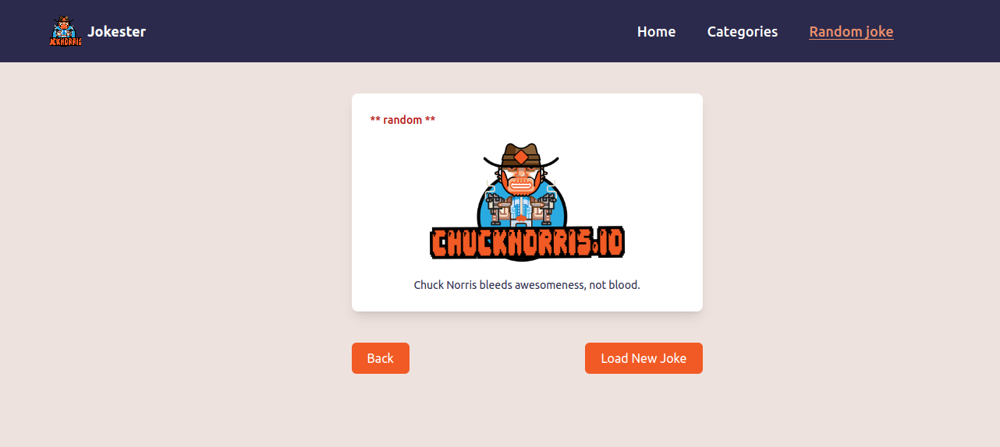

## Jokester 
Jokester is a fun and entertaining web application that fetches Chuck Norris jokes from the Chuck Norris jokes API. It uses graphql server to wrap the API and a react client to display the jokes. 

## Screenshots
### Homepage


### Categories


### Joke



## Demo
[Live Demo](https://jokester.vercel.app/)


## Tech/framework used
<b>Built with</b>
- [React](https://reactjs.org/)
- [GraphQL](https://graphql.org/)
- [Apollo](https://www.apollographql.com/)
- [Tailwind CSS](https://tailwindcss.com/)
- [Chuck Norris Jokes API](https://api.chucknorris.io/)

## Features
- Fetches random jokes from the Chuck Norris jokes API
- Fetches jokes by category

## Installation
1. Clone the repo
```sh
git clone git@github.com:geoffreykithuku/jokester.git
```
2. Install NPM packages
```sh
npm install
```
3. Run the app
```sh
npm start
```

## Server setup
1. In the cloned repo, navigate to the server directory
```sh
cd server
```
2. Install NPM packages
```sh
npm install
```
3. Run the server
```sh
npm start
```

